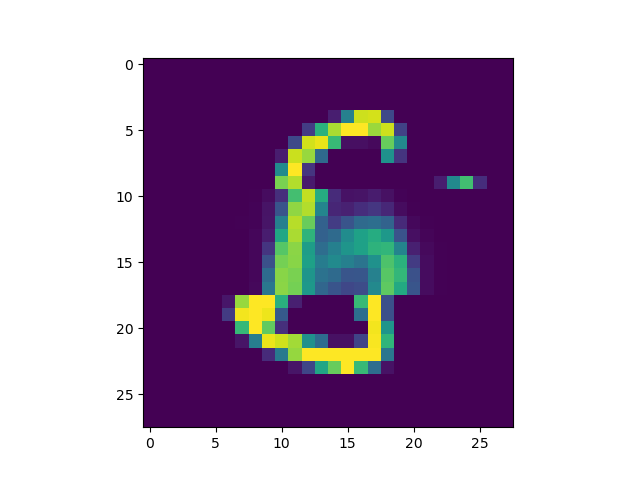

# Using Backpropagation to Reconstruct Missing Inputs of Neural Networks

This repository contains the code for reconstructing missing input data to neural networks with backpropagation. 
The method is inspired from [Roche et al. 2023](https://arxiv.org/abs/2308.10496). 

The idea is that the trained weights of a neural network can be used to reconstruct missing input data to the neural network, 
by simply including the missing data in the gradient and optimize its values via backpropagation.

## Experimental Evaluation
We evaluate the results with the MNIST dataset (a full empirical evaluation can be found the publication above)
Therefore, we trained a simple Autoencoder on the complete MNIST dataset. 
We then masked single samples with a zero-tensor, as missing values.

**Sample & Masked Sample**

  
  

We included only the missing values as optimizable parameters in the optimizer and optimized it over $n$ epochs.
Reconstructions on during different iterations.

**Reconstruction of the masked sample over different iterations of optimization**

  
  
  

## Requirements

`python >= 3.8`
`torch >= 2`
`numpy >= 1.23`
`matplotlib.pyplot >= 3.8`

## LICENSE 

Licensed under MIT license
